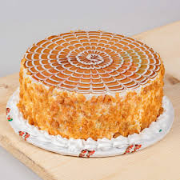
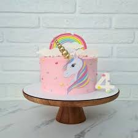
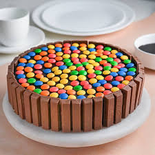

# summer-term-project

<!DOCTYPE html>
<html lang="en">

<head>
    <meta charset="UTF-8">
    <meta http-equiv="X-UA-Compatible" content="IE=edge">
    <meta name="viewport" content="width=device-width, initial-scale=1.0">
    <title>Sweet Cake</title>
    <link href="https://stackpath.bootstrapcdn.com/bootstrap/4.5.2/css/bootstrap.min.css" rel="stylesheet">
</head>

    <!-- swiper link  -->
    <link rel="stylesheet" href="https://unpkg.com/swiper/swiper-bundle.min.css" />

    <!-- cdn icon link  -->
    <link rel="stylesheet" href="https://cdnjs.cloudflare.com/ajax/libs/font-awesome/5.15.4/css/all.min.css">
    <!-- custom css file  -->
    <link rel="stylesheet" href="style.css">

</head>

<body>
    
    <!-- header section start here  -->
    <header class="header">
        

            
            <h1 class="logoName">Sweet Cake </h1>
        

         <!-- Rounded switch -->
<label class="switch">
    <input type="checkbox">
    
  </label>

        <nav class="navbar">
            <a href="#home">home</a>
            <a href="#product">product</a>
            <a href="#blogs">blogs</a>
            <a href="#review">review</a>
            <a href="contact.html">contact</a>
               
        </nav>

       

        

            <i class="fas fa-search" id="search"></i>
            <i class="fas fa-bars" id="menu-bar"></i>
        

        

            <input type="search" placeholder="search...">
        

    </header>
    <!-- header section end here  -->

    <!-- home section start here  -->
    <section class="home" id="home">
        

            <h2>Delicious Cake for Everyone </h2>
            
Our expertly crafted cakes are made with the highest quality ingredients, offering a delightful array of flavors and designs perfect for any occasion. From classic favorites to innovative creations, there's something delicious for everyone to enjoy. Come and taste the difference today!

            

            

                <a href="#"><button>see more</button></a>
            

        

    </section>

    <!-- home section end here  -->

    <!-- product section start here  -->
    <section class="product" id="product">
        

            <h2>Our Exclusive Products</h2>
        

        

            

                

                    

                        
                    

                    

                        <h3>Chocolate</h3>
                        
Dive into pure indulgence with our Heavenly Chocolate Cake. Rich, moist, and decadently chocolatey, this cake is a chocolate lover's dream come true. Made with the finest cocoa and layered with velvety chocolate ganache, each slice promises a melt-in-your-mouth experience. Perfect for any occasion or simply to satisfy your sweet cravings. Treat yourself to a slice of chocolate paradise!
                        

                        

                            
                            <button>Order Now</a> </button>
                        

                    

                

                

                    

                        
                    

                    

                        <h3>Buttersoatch</h3>
                        
Experience the ultimate in sweetness with our Irresistible Butterscotch Cake. This delectable creation features layers of soft, moist cake infused with the rich, buttery flavor of butterscotch. Topped with smooth, creamy butterscotch frosting and a drizzle of luscious butterscotch sauce, each bite is a heavenly blend of sweetness and texture. Perfect for celebrations or just because, this cake is sure to delight your taste buds and leave you craving more!
                        

                        

                            <button>Order Now </button>
                        

                    

                

                

                    

                        
                    

                    

                        <h3>German Forest</h3>
                        
Delight in the rich flavors of our Exquisite German Forest Cake. This classic dessert features layers of moist chocolate sponge cake, filled with luscious whipped cream and tart cherries. Finished with a generous dusting of chocolate shavings and crowned with a drizzle of cherry syrup, each slice is a perfect harmony of sweetness and tanginess. Ideal for special occasions or simply to indulge your sweet tooth, our German Forest Cake is a true masterpiece of flavor and elegance.

                        

                        

                            <button>Order Now </button>
                        

                    

                

                

                    

                        
                    

                    

                        <h3>Unicorn rainbow cake</h3>
                        
Delight your guests with a magical and whimsical Rainbow Unicorn Cake! This enchanting creation is perfect for birthdays, celebrations. The Unicorn Cake can be personalized with a special message or name, written in elegant script on the cake board or directly on the cake itself. Choose from a variety of color options for the writing to match your theme or preference.Make your celebration unforgettable with our enchanting Unicorn Cake  a delightful treat that’s as beautiful as it is delicious! 

                        

                            <button>Order Now </button>
                        

                    

                

            

            

        

        

            

                

                    

                        
                    

                    

                        <h3>Rasmalai Cake</h3>
                        
This unique dessert combines the beloved taste of rasmalai with the elegance of a layered cake, perfect for any celebration, from birthdays to festive occasions.Our Rasmalai Cake is a visual delight, featuring multiple layers of soft, spongy cake soaked in fragrant saffron and cardamom-infused milk, reminiscent of the traditional rasmalai syrup. The cake is elegantly frosted with a rich, creamy whipped cream frosting that is lightly flavored with cardamom, giving it a subtle, aromatic touch.
                        

                        

                            <button>Order Now </button>
                        

                    

                

                

                    

                        
                    

                    

                        <h3>Redvelvet Cake</h3>
                        
Savor the allure of our Red Velvet Cake, a classic dessert renowned for its rich flavor and luxurious appearance. Whether celebrating a special occasion or simply craving a decadent treat, this cake promises to captivate with its velvety texture and indulgent ,Our Red Velvet Cake is a visual masterpiece, boasting layers of moist, crimson-colored cake generously sandwiched between smooth, creamy layers of decadent cream cheese frosting. The cake's exterior is elegantly coated with more of the luscious cream cheese frosting, creating a luxurious finish that invites admiration.
                        

                        

                            <button>Order Now </button>
                        

                    

                

                

                    

                        
                    

                    

                        <h3>Kikat Cake</h3>
                        
Our KitKat Cake is perfect for birthdays, parties, celebrations, or any occasion where you want to surprise and delight guests with a playful and delicious dessert. It’s a crowd-pleaser that appeals to both children and adults alike.Customize your KitKat Cake with a personalized message or name, elegantly written in chocolate or piped frosting on the cake board or directly on the cake itself. Adjustments can also be made to the level of sweetness or the amount of KitKat bars used, ensuring the cake meets your preferences.
                        

                        

                            <button>Order Now </button>
                        

                    

                

                

                    

                        
                    

                    

                        <h3>Mawa Cake</h3>
                        
Our Mawa Cake is perfect for cultural celebrations, tea time gatherings, festivals like Diwali, or any occasion where you want to introduce guests to the delightful flavors of Indian sweets. Its unique taste and texture make it a memorable addition to any dessert table.Delight in the rich flavors and cultural essence of our Mawa Cake – a traditional Indian treat that promises to enchant with every bite, bringing warmth and nostalgia to your festivities.Experience the rich. Perfect for celebrating cultural traditions or simply indulging in a unique culinary experience.
                        
                        

                        

                            <button>Order Now </button>
                        

                       
                       

                         
                    

                

            

           
           
        

    </section>

    <!-- product section end here  -->

    <!-- blogs section start here  -->
    <section class="blogs" id="blogs">

        

            

                

                    

                        
                    

                    

                        <h3>Caramel Bourbon Vanilla Cupcakes </h3>
                        
Lorem, ipsum dolor sit amet consectetur adipisicing elit. Eligendi dolorum voluptatum
                            corporis accusamus aperiam fugiat tempora blanditiis labore dolor aliquid maxime nobis
                            laborum sed soluta voluptatibus aspernatur natus, dicta quisquam.

                        
Lorem ipsum, dolor sit amet consectetur adipisicing elit. Totam ab ullam reiciendis sint
                            eaque at.

                        <a href="#blogs" class="btn">learn more</a>
                    

                

                

                    

                        
                    

                    

                        <h3>Caramel Bourbon Vanilla Cupcakes </h3>
                        
Lorem, ipsum dolor sit amet consectetur adipisicing elit. Eligendi dolorum voluptatum
                            corporis accusamus aperiam fugiat tempora blanditiis labore dolor aliquid maxime nobis
                            laborum sed soluta voluptatibus aspernatur natus, dicta quisquam.

                        
Lorem ipsum, dolor sit amet consectetur adipisicing elit. Totam ab ullam reiciendis sint
                            eaque at.

                        <a href="#blogs" class="btn">learn more</a>
                    

                

                

                    

                        
                    

                    

                        <h3>Caramel Bourbon Vanilla Cupcakes </h3>
                        
 

                        <a href="#blogs" class="btn">learn more </a>
                    

                

            

            

            

            

        

    </section>

    <!-- blogs section ends here  -->

    <!-- newsletter section start here  -->

    <section class="newsletter">
        <form action="">
            <h3>subscribe for latest update</h3>
            <input type="email" name="" placeholder="enter your email" id="" class="box">
            <input type="button" value="subscribe" class="box2">
        </form>
    </section>
    <!-- newsletter section ends here  -->

    <!-- review section start here  -->
    <section class="review" id="review">
        

            <h2>client review</h2>
        

        

            

                

                    

                        
 The cake was not only visually stunning but also absolutely delicious. The design matched my vision perfectly, and the flavors were incredible – moist, rich, and just the right amount of sweetness. The attention to detail was evident in every aspect, from the intricate decorations to the smooth finish. The customer service was top-notch, with the team being responsive and accommodating to all my requests. I received so many compliments on the cake, and it truly made the event special. I highly recommend [Bakery Name] for any occasion. Thank you for making our celebration memorable!"

                    

                    

                        

                            
                        

                        

                            <h3>Rajesh Raut</h3>
                            
 Customer

                        

                    

                

                

                    

                        
 The cake was not only visually stunning but also absolutely delicious. The design matched my vision perfectly, and the flavors were incredible – moist, rich, and just the right amount of sweetness. The attention to detail was evident in every aspect, from the intricate decorations to the smooth finish. The customer service was top-notch, with the team being responsive and accommodating to all my requests. I received so many compliments on the cake, and it truly made the event special. I highly recommend [Bakery Name] for any occasion. Thank you for making our celebration memorable!"

                    

                    

                        

                            
                        

                        

                            <h3>Vedant shelke</h3>
                            
 Customer

                        

                    

                

                

                    

                        
This cake exceeded all my expectations. It was not only a treat for the taste buds but also a feast for the eyes. I highly recommend [Bakery Name] for anyone looking to enjoy a delicious and beautifully crafted cake. I can't wait to order my next cake from them!

                        

                    

                    

                        

                            
                        

                        

                            <h3>Sumit Rathod</h3>
                            
 Customer

                        

                    

                

                

                    

                        
This cake exceeded all my expectations. It was not only a treat for the taste buds but also a feast for the eyes. I highly recommend [Bakery Name] for anyone looking to enjoy a delicious and beautifully crafted cake. I can't wait to order my next cake from them!

                        

                    

                    

                        

                            
                        

                        

                            <h3>Vedant shelke</h3>
                            
 customer

                        

                    

                

                

            

        

    </section>
    <!-- review section ends here  -->

    <!-- footer section start here  -->

    <footer class="footer" id="contact">
        

            

                

                    
                    <h1 class="logoName"> Sweet Cake </h1>
                

                
Lorem ipsum dolor, sit amet consectetur adipisicing elit. Dicta accusamus maxime quod.

                
            

            

                <h3>Quick link</h3>
                <a href="#"> <i class="fas fa-arrow-right"></i>Home</a>
                <a href="#"> <i class="fas fa-arrow-right"></i>product</a>
                <a href="#"> <i class="fas fa-arrow-right"></i>blogs</a>
                <a href="#"> <i class="fas fa-arrow-right"></i>review</a>
                <a href="#"> <i class="fas fa-arrow-right"></i>contact</a>

            

            

                <h3>Extra link</h3>
                <a href="#"> <i class="fas fa-arrow-right"></i>Account info</a>
                <a href="#"> <i class="fas fa-arrow-right"></i>order item</a>
                <a href="#"> <i class="fas fa-arrow-right"></i>privacy policy</a>
                <a href="#"> <i class="fas fa-arrow-right"></i>payment method</a>
                <a href="#"> <i class="fas fa-arrow-right"></i>our  services</a>
            

            

                <h3>Contact Info</h3>
                <a href="#"> <i class="fas fa-phone"></i>+91 12222 34444</a>
                <a href="#"> <i class="fas fa-envelope"></i><waghmareshweta14072gmail class="com"></waghmareshweta14072gmail></a>

            

        

        

            
            
            
            
            
        

        

            created by Miss.Shweta Designer  |all rights reserved ! 
        

    </footer>

    <!-- swiper js link  -->
    

    <!-- custom js file  -->
    

</body>

</html>
